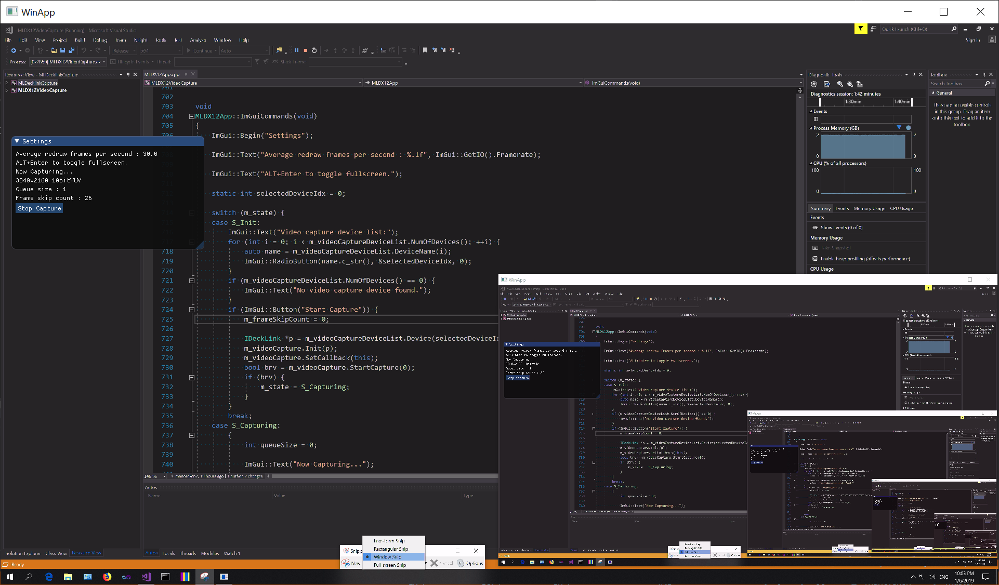

Manoretimedia Kenkyuujyo project files
==============

HDR10Viewer2 project
--------------

Sends HDR10 image to HDR10 display using DirectX12 API.

How to build

Open HDR10Viewer2.sln with Visual Studio 2019 and build.

  * Note 1: The following screenshot image is converted to SDR and brighter part is saturated to white.
  * Note 2: The OpenEXR image is generated with Blender, the scene file is "Class room By Christophe Seux" https://www.blender.org/download/demo-files/#cycles
  

MLDX12VideoCapture project
--------------

Video capture program using DirectX12 and Decklink Mini recorder 4K.

It can preview Raw SDI stream of Blackmagic Micro Studio Camera 4K.
Please use BMRawAVIv210ToDng to convert from recorded Raw SDI yuv v210 AVI file to Cinema DNG.

How to build

Decklink SDK 10.11.4 is necessary to build.
Copy Blackmagic DeckLink SDK 10.11.4\Win\include\* to MLDecklinkCapture\Decklink directory.
Open MLDX12VideoCapture\MLDX12VideoCapture.sln using Visual Studio 2017 and build.

### About output AVI file of MLDX12VideoCapture 

Currently only YUV 10bit v210 format can be recorded.

Output AVI file does not have index chunk and not completed. Mencoder can fix the index. Example:

> mencoder -idx output.avi -ovc copy -oac copy -o fixed.avi

  
  
  
How to build ImageToDng, DngHeaderDump etc.
--------------

Use cmake-gui to create Visual Studio solution and projects.
Open solution file using Visual Studio and build. right click project and select set as startup projects and run.

ImageToDng project
--------------

Windows program to convert image to 8bit RAW CFA(Color Filter Array) DNG format.

Conversion is lossy process: Bayer pattern is applied to the image, green channel resolution is reduced by √2 x, red and blue channel resolution is reduced by 2x. Please refer this document: https://en.wikipedia.org/wiki/Bayer_filter

Also low-pass prefilter that should be applied before applying Bayer pattern is omitted, so aliasing artifact may appear.

To show this image, it is necessary to demosaic it to recover RGB image.
Dng image can be opened by RAW image development software such as RawTherapee.

Following Bayer patterns are available:
  * RG/GB
  * BG/GR
  * GR/BG
  * GB/RG

Bugs: 
  * Thumbnail image is wrong.

DngHeaderDump project
--------------

DngHeaderDump is a console app to read and show all IFD header info of the specified DNG file.

It shows your camera name, camera serial number, image number, lens name, exposure settings, battery level, GPS location, GPS time and so on.

DNG (Digital Negative) file can be created from digital camera Raw files (CR2, NEF, ARW ...), by converting to DNG file using free Adobe DNG Converter.

BMRawYuv422p10ToDng project
--------------

Reads Blackmagic Micro Studio Camera 4k 12bit raw image data encoded in yuv422p10le file and writes it as 12bit Raw DNG file.

yuv422p10le file can be created using ffmpeg.

